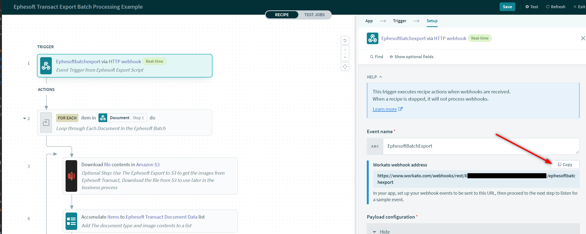

# Transact.Integration.Workato
A repository to integrate Ephesoft Transact to workato. This repository can be used with the Ephesoft Workato connector.

## Architecture  
This solution uses the [Workato custom connector](https://www.workato.com/custom_adapters/19399/details?community=true) 
to get information into Ephesoft Transact from Workato. To get information back into Workato from Transact, webhooks are used to 
trigger Workato recipes. To trigger the Workato webhooks the Ephesoft Export Script plugin is used to push data to workato 
via a webhook. The Webhook is used Only to move Transact extraction metadata to Workato. If a project needs the exported
images from Transact to Workato it is recommended to use an online file repository such as Box.com or Amazon S3. 

## Workato Recipe Library 
Ephesoft has published a few starter recipes to help show how the data that Ephesoft classifies and extracts can flow into 
downstream systems and processes. Below are links to the recipes in Workato. You can find recipes like these by searching the 
keyword "Ephesoft" in the Workato community recipe library. You can read more about what these recipes do in the recipe description.

- [Ephesoft Transact - Export Invoice Data to Oracle](https://app.workato.com/recipes/1856039-ephesoft-transact-export-invoice-data-to-oracle?community=true)
- [Create a Bill in NetSuite](https://app.workato.com/recipes/1698820-new-netsuitebill?community=true)
- [Get-NormalizedTerm](https://app.workato.com/recipes/1698819-get-normalizedterm?community=true)
- [Invoke-LineItem-InvoiceTotal-Validation](https://app.workato.com/recipes/1856038-invoke-lineitem-invoicetotal-validation?community=true)

## Prerequisites
- Ephesoft Transact with an Ephesoft Webservice License (web service is needed to work with the workato custom connector)
- Batch Class Management access and the ability to deploy Transact workflow scripts

## Artifacts:
- Ephesoft export script [ExportScript.java](Script Source/ScriptExport.java)
- Workato Ephesoft batch export example recipe [Ephesoft Transact - Export Batch Processing Example](https://app.workato.com/recipes/2391763-ephesoft-transact-export-batch-processing-example?community=true)

## Workato Recipe Configuration 
1) Log into Workato and navigate to the example recipe [Ephesoft Transact - Export Batch Processing Example](https://app.workato.com/recipes/1856039-ephesoft-transact-export-invoice-data-to-oracle?community=true)
2) Click the **Use This Recipe** button to add a copy of the recipe to your account
3) Edit the recipe and copy the webhook address 
   
4) Fix any Recipe connection errors or empty fields and start the recipe
> **Note:** If the recipe is not running the Ephesoft batch instance will go into error status, and you will need to start the recipe
> and restart the batch at Export. 
## Configuration in ExportScript.java

4) Edit the Ephesoft export script file [ExportScript.java](Script Source/ScriptExport.java).
In the script replace the WEBHOOK_MAPPING_BATCH_URL variable to be the value of the webhook address copied from the recipe. 

            public static String WEBHOOK_MAPPING_BATCH_URL = "https://www.workato.com/webhooks/rest/xxxxxxx-xxxxx-xxxx-xxxxxx/ephesoftbatchexport";

5) Move the **ScriptExport.java** to the scripts' folder for your chosen batch class, at  [Ephesoft_Directory]\Shared-Folders\<your batch class>\Scripts.
 or use the Ephesoft File Management Screen to upload the Export Script to your batch class
6) Add the following plugin to the batch classes export module **EXPORT_SCRIPTING_PLUGIN**
7) **Optional Step:** If Ephesoft output images are needed for your project, an export location for the image will be needed.
The Ephesoft [Amazon S3](https://github.com/Ephesoft-Labs/Transact.Toolkit.Export/tree/master/Export%20Plugins/s3-export-plugin) 
export plugin is used as an example but other supported file content repertoires can be used as well. 
> **Note:** the order of the plugins are important. The EXPORT_SCRIPTING_PLUGIN needs execute after the S3_EXPORT_PLUGIN. 
> This will ensure that the images are exported prior to having the recipe to download them.

## Known Unsupported Data
- Currently, this export script does not support Ephesoft table extracted data. 

# License
Ephesoft Labs is licensed under the Ephesoft Source Code License. 
